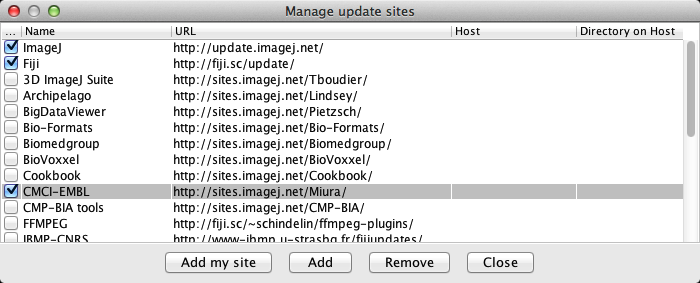

#第三回少数性生物学トレーニングコース　画像解析


三浦耕太　<http://cmci.embl.de>  
所属：　   

1.  自然科学研究機構研究力推進本部欧州拠点
2.  基礎生物学研究所
3.  EMBL・先端光学顕微鏡施設・分子細胞イメージングセンター（ドイツ）

20150804,5 於　吹田・大阪大学産業科学研究所

[toc]

#目的

1. ImageJのGUIを使って基礎的な画像処理・解析を学ぶ。
2. JythonプログラミングによってImageJを使う方法を学ぶ。
3. 新井さんのPTAjをJythonで操作する方法を知る。
4. 大量の画像データのトラッキングをJythonからPTAjを使うことで可能にする。
5. 輝点の位置測定の精度を算出する。

#序

画像解析により現象を定量化し統計的に分析することは生物学における重要な技術である。現在、画像データはどんどん複雑化しており（次元、データの数の増大）、さらに複数の画像処理アルゴリズムを組み合わせて解析を行うことが多くなった現在、解析を行うにはなんらかのプログラミングが必要となる。

今回の実習では簡単なプログラミングを使った画像解析と統計的な分析を学ぶ。ツールとしてはImageJを用いる予定である。解析対象は実習期間中に取得する膜上を運動するTransferrinの動画像データである。このデータを分析し、実験条件下におけるTransferrinの拡散定数を推定することが目的となる。このために、Transferrinのトラッキングを[新井由之さんが開発したImageJのプラグインPTAj](https://github.com/arayoshipta/projectPTAj)を使って行う。トラッキングによりまず座標の時系列を得る。次にこのデータから、平均自乗距離法（MSD, Mean Square Displacement）の計算を行う（MSDの計算もPTAjに含まれている）。MSD vs. Time Scale のフィッティングを行い、拡散定数の推定を行う。

データがひとつだけであれば、手動で解析を行い結果を得ることは十分可能である。大量のデータを解析したい場合にも労力さえ厭わなければすべてを手動でできるが、解析に要する労力の増大、それに比例するモーティベーションの低下、それにともなう測定精度の低下が生じる。このためまず手動では時間のかかるステップをそれぞれ自動化し、さらにそれらを組み合わせて全体を一つのスクリプトで処理できるようにする。こうした処理の自動化の利点は、今回の実習の場合では画像の前処理やトラッキングのパラメータを変更してすべてのデータを解析し直したいときに、スクリプト内のパラメータを書き直すことで気軽にトライできる、ということにもある。手動であれば、「使っているパラメータがどうも具合悪い」といったときに絶望的な気分に陥ることは避けがたい。

Javaで書かれているプログラムは、PythonをJavaで実装したJythonを使ってスクリプトを書くことができる。今回の実習では、Fiji（ImageJのディストリビューション）のスクリプトエディターを使う。Jythonの基礎、さらにファイルシステムに保存された画像ファイルへのアクセス、プラグインのクラスの使い方などを学ぶ。このことで、Transferrinの拡散定数推定を、多くの画像データをもとに行うスクリプトを書けるようになることを目指す。

ImageJはご存知のように誰もがダウンロードしてすぐに使うことのできるパブリックドメインの画像処理・解析ソフトである。GUIを使ったマウスのみによる操作からJavaプログラミングによる機能の追加、クラスタを使った大規模な計算まで幅広い使用が可能であること、数多くの研究者・開発者が関わっていることなどから、生物学研究者にとってその習得にはさまざまな利点がある。今回の実習では、GUIの基本的な使い方を概観した後に、JythonのスクリプトでImageJの機能を使うことを学習する。

なお、GUIによる一般的な使い方は下記にリンクするCMCIのウェブサイトから入手可能な教科書に網羅的に記載されており自習可能である。また、ImageJには独自のマクロ言語があるが、今回の実習では使わない。

ImageJ Textbooks

<http://cmci.embl.de/documents/ijcourses>

#実習の準備

まずウェブブラウザのブックマークに入れておいて欲しいサイトがある。ImageJの本家。

<http://imagej.net>

基本的な情報はこちらからアクセス可能である。

##Fijiのインストール

Fijiは数多くあるImageJのディストリビューションの一つである。まず次のサイトからそれぞれのOSに適合したインストーラをダウンロードする。

なお、目下Fijiは、内部でつかっているライブラリを大幅に次世代のImageJ2に移行しつつあり、作動が不安定な部分がある。このため、最新のバージョンではなく、"Life Line Version"と呼ばれる安定版のうち、2014年11月25日のものを使うことをおすすめする。

<http://fiji.sc/Downloads>

上記ダウンロードページのインストールの仕方を読み、圧縮ファイルを解凍した後、所定のスッテプにしたがいFijiをインストールする。完了したら、Fijiメニューの

`[Help > Update Fiji]`[^1]

によってプログラムを最新の状態にする。アップデータのモジュール自体が新しくなるなどの場合、何度かアップデートとFijiの再起動を繰り返すことが必要になる。

### Fijiに関するもう少し詳しい解説

Fijiは複数の研究者や開発者がGitを通じて継続的に機能を追加・修正しているシステムという特徴がある。このためコードはすべてオープンであるが、科学研究において使われるすべてのコードはオープンでなければ科学的な評価ができない、という立場からもオープンソースを推進している。ユーザーの立場から眺めると、ImageJに比べて機能がとても多い。まずなんのためにどの機能を使ったら良いのか、という点でつまずくケースを多く見かける。とはいえ、習熟した暁には多様な機能を複合的に使うことができるようになり、更にはプラグインなどを独自に開発する際に、自前ですべてを書くことなくさまざまなライブラリを組み合わせることで効率的に目的の機能の実装を果たすことが可能になる。今回Fijiを使用する主な理由は、Jythonでスクリプトを書く際にScript Editorが簡便だからである。

###演習用画像・プラグインのダウンロード

####演習用の画像

今回の実習では、直接ダウンロードのリンクからプラグインやサンプル画像をそれぞれ入手する。

- サンプル画像のパッケージ
  - <https://www.dropbox.com/s/d3ewlmh6ugw80dc/samples.zip> [57Mb]

####プラグインのインストール

プラグインのインストール方法はぜひとも知っておくべきである。二つの方法があり、方法１が最新の方法であるが、インストールしたいプラグインがFijiのアップデートサイトに登録されていないと使えない。この手段は2013年後半に加わったのでまだ数はかぎられるが今後どんどん増えていくだろう。プラグインがアップグレードすると、自動的にローカルでも認識して更新してくれる。方法２は従来の方法で、どのようなプラグインでもこの方法でインストールできる。

**方法1**

Fijiを立ち上げ、Lのキーを叩いてコマンド・ファインダを開き、[Update Fiji]を実行しよう。Fijiがプラグインの更新状況を調べるのに若干時間がかかるが、しばらくするとImageJ Updaterというウィンドウが表示される。もしすべてのプラグインが最新の状態にあるならば、"Your ImageJ is up to date!"というウィンドウが表示され、なにもリストされていない状態で表示されるだろう。


図 ImageJアップデータ

更新が必要なものがある場合にはそれらのファイルがリストされるので、"Apply Changes"をクリックすればそれらすべてのファイルが自動的に置き換えられ、Fijiに最初から入っているさまざまなプラグインの更新は完了する。これはいわば、Fiji純正のアップデートサイトに対してのみ更新状況を問い合わせているということになる。

自分でアップデートサイトを追加すれば、そのサイトのプラグインをインストールするのみならず更新状況を自動的に管理できるようになる。左下にある"Manage update sites"をクリックする。新しいウィンドウが立ち上がり、図のように、追加可能なアップデートサイトがリストされるはずである。デフォルトでチェックが入っている最初の二つはImageJとFijiのサイトである。これはまさにImageJとFijiそのものであり、上で述べた「純正のアップデートサイト」である。それに続く他のサイトが各自の必要に応じて登録するサイトである。



図 アップデートサイトのリスト　

今回はCMCI-EMBLというサイトにチェックを入れ、Addのボタンをクリックして登録しよう。この時点でなにもおこらないが、Closeをクリックしてウィンドウを閉じ、Updatorのウィンドウを見ると、新たに"plugins/EMBL_sampleimages.jar"という行が加わっているはずだ。右側には"Install it"と表示されているはずである。そこで"Apply Changes"をクリックするとダウンロードとインストールが行われる。このあとリスタートせよ、というウィンドウが表示されるので、Fijiを再起動するとメニューバーにEMBLという新しい項目が追加されているはずだ。サンプルの画像は、[EMBL > Samples >]以下にリストされている。今回使用する画像はすべてここにある。


**方法2**

次のページのプラグインをダウンロードする。

- [http://cmci.github.io/CourseUtil/](http://cmci.github.io/CourseUtil/)

あるいはCMCIのトップページ（cmci.embl.de）からの場合は、

`Downloads > Sample Image Loader`

を辿る。ローカルに保存したファイルの名前は

`EMBL_sampleimages***.jar`

(***はバージョンの番号)のはずである。これを確認したら、Fijiのメニューから、

`[Plugins > Install Plugin]`

を行い、

`EMBL_sampleimages***.jar`

を選ぶ。インストールが成功するとメニューに"EMBL"という項目が現れる。もしこの項目が現れなかったら、

`[Help > Refresh Menus]`

により、メニューを再読み込みする。うまくインストールの完了をチェックするため、

`[EMBL > Samples > blobs.tif]`

により、画像“blobs.tif”をネットを通じてロードできることを確認する。

なお、プラグインの追加は、より簡単にプラグインのjarファイルをメニューバーにドラッグドロップすることでも可能である。

### 他のプラグイン

#### Running Z Projector

フレーム1-3、2-4、3-5、といった順番で数フレームの平均画像を生成する。マイクロマネージャを開発しているNico Stuurmanが書いたプラグイン。

- サイト
  - <http://valelab.ucsf.edu/~nico/IJplugins/Running_ZProjector.html>
- プラグイン
 - <http://valelab.ucsf.edu/~nico/IJplugins/download/plugins/Stacks/Running_ZProjector.class>

#### Particle Tracker

自動トラッキングのプラグイン。細胞内を動くウィルスをトラッキングするために開発された。Ivo SbalzariniがETHの院生だったころに書いたMatlabのコードを、Guy LevyとJanick CardinaleがImageJにマイグレートしたプラグイン。

- サイト
  - <http://mosaic.mpi-cbg.de/?q=downloads/imageJ>
- マニュアル
  - <http://mosaic.mpi-cbg.de/ParticleTracker/>
- プラグイン
  - <http://mosaic.mpi-cbg.de/Downloads/Mosaic_ToolSuite.jar>
- Gitrepo
  - <https://git.mpi-cbg.de/gitweb/?p=ImageJ.git;a=summary>


#### PTAj (developer version)

新井さんが開発した一分子トラッキング用のプラグイン。当日ダウンロードしてインストールしてください。点状のシグナルに対して2次元ガウス分布をフィッティングして中心の位置を推定することができる。

- サイト
  - <http://www.sanken.osaka-u.ac.jp/labs/bse/ImageJcontents/frameImageJ.html>
- プラグイン
  - <https://github.com/cmci/projectPTAj/blob/master/target/PTA_-1.0.0.jar?raw=true>

[Javadoc](http://cmci.github.io/projectPTAj/)


#画像処理・解析の基礎

画像処理・解析に関していくつかのトピックを取り上げる。


## 数をかぞえる

デジタル画像は数値の分布である。我々がモノと認識する対象を対象であるとするには、なんらかの定義を与える必要がある。これを分節化（segmentation）という。一定の定義にしたがって画像はモノの領域と背景の領域に分類される。分節化に仕方にはいろいろあるが、今回は教師つきの機械学習によってそれぞれのピクセルをモノと背景に分割し、モノの数をかぞえる方法を紹介する。

より詳しくは教科書の1.4.4節を参照にせよ。

- サンプル画像　rice.tif

##多次元画像の扱い

多次元画像（たとえば複数チャネルの3次元時系列など）の取り扱いは、コンピュータのスクリーンが二次元であることから自ずから限界がある。可視化・編集などで次元を下げて扱う、ということが中心になる。ここではImageJに実装されている工夫をいくつか紹介する。

サンプル画像

- wt1.tif
- listeriacells.stk
- mitosis_anaphase_3D.tif


###可視化

教科書の1.1.9節を参照にせよ。

- Projections
- t-Color coding
- OrthoView
- 3Dviewer

###編集

教科書の1.1.11節を参照にせよ。


## 時系列：輝度の測定

教科書の1.4節を参照にせよ。

- 輝度の時系列の取得
- ブリーチング(蛍光強度減衰)の校正
- 偽ハイパスフィルタ

サンプル画像　virus.tif

## 時系列：運動の測定

教科書の1.5節を参照にせよ。

- 時系列画像の差分
  - サンプル　1703-2(3s-20s).stk
    - <https://www.dropbox.com/s/jo5tdgn6wqt77bw/1703-2%283s-20s%29.stk>
- カイモグラフの作成と測定
  - サンプル　eb1_8b.tif 
    - <https://www.dropbox.com/s/u1qkhgunamq9uou/eb1_8b.tif>
  - 速度推定用のマクロ　
    - <https://gist.github.com/anonymous/6150781>
- 自動トラッキング　Particle Tracker
  - サンプル　TransportOfEndosomalVirus.tif
    - <https://www.dropbox.com/s/pwvezy2dey4n73y/TransportOfEndosomalVirus.tif> 


#Jythonスクリプトの書き方

## 序論
ImageJには独自のマクロ言語が実装されており、多くの作業はマクロで記述可能である。とはいえImageJのマクロはGUIを経由したスクリプトであるため、ヘッドレス（GUIなし）で使用する際にはさまざまな制限が生じる。また、マクロの関数が用意されていないプラグインを使う場合などに不自由を感じることがある。これらの問題があるときにはJavaの仕様（APIと呼ばれる）に直接アクセスできるスクリプト言語を使う必要がある。

ImageJにおけるスクリプティング言語としては他にJavascript(Rhino)や、Jython
(Javaで実装したPython)などがある。処理速度を高めたいならば、ClojureもしくはScalaを使う。JavascriptはImageJにおいてそのまま使うことが出来る。また、Javascriptはコマンドレコーダの記録言語としても実装されており、マクロと同じように記述することができる。ただしこの場合の運用は、マクロと同程度の機能に限られるので、Javadocを駆使しながらコーディングを行うのでなければマクロでプログラムを書くことをお勧めする（今回の実習ではマクロの学習は割愛する）。

JythonはPythonの文法であること、Jython自体に実装されているさまざまな機能があることから（特に文字列操作、ファイルシステムへのIOにおいてさまざまなメリットがある）、Jythonを使う研究者が多い。ImageJではJythonのファイルを実行した時にJythonのライブラリが存在しないことがわかると、ImageJはJythonのライブラリを自動的にダウンロードする。Fijiでは最初からJythonが導入されている。

今回はJythonによるスクリプティングを学ぶ。ImageJのさまざまなクラス群（ImageJはそれぞれ特定の機能をもつJavaでプログラムされたクラスが複数集まった存在であると考えると良い）を扱うには、クラス群の諸機能を参照するためのレファレンスが必要になる。Javadocと呼ばれる仕様書（ImageJの場合にはImageJのJavadoc）がこれにあたり、プログラミングの基本を習得したあとはJavadocを繰りながらスクリプトを書くことになる。ImageJのJavadocは次のリンク先にある。

<http://imagej.net/developer/api/>

##参照になるページ

Jythonそのものに関しては、

<http://www.jython.org/docs/>

以下のリンクは、今後JythonでImageJ/Fijiのスクリプティングを行う際に参考になるページである。

[Jython Tutorial @ Fiji wiki](http://fiji.sc/Jython_Scripting)

[Jython Cookbook @ CMCI](http://cmci.embl.de/documents/120206pyip_cooking/python_imagej_cookbook)


## はじめの一歩

### スクリプトエディタの使い方

スクリプトエディタ(Script Editor)はFijiのメニューから

[File > New > Script]

を選ぶことで開始できる。より簡便には

Ctrl-L (win)

Command-L (osx)

のショートカットキーでコマンドファインダを呼び出し、'Editor'と入力すると、Script Editorがトップに選ばれるのでそれを選択しリターンキーを押せば良い。

スクリプトエディタには独自のメニューがついている。そのうちの一つが'language'であり、この項目をクリックして、'Python'を選ぶことで、Jythonのコマンドを解釈させることができるようになる。

エディタは上下ふたつのパネルにわかれており、上がスクリプトを入力するテキストフィールド、下が出力フィールドになっている。間にはRunボタンが左側に、右側にはStdout（通常の出力）とStderr（エラー出力）の二種を選ぶボタンがあり、デフォルトでは通常の出力が表示される。

### Hello World

スクリプトエディタのテキストフィールド（上部）に以下のように入力する。

```python
print "Hello World!"
```

左下にある'Run'ボタンをクリックすると、下側のテキストフィールドに

	Hello World!

と表示されるはずである。この場合、出力先はスクリプトエディタである。`print`はJythonのコマンドであり、そのあとのスペースに続く文字列ないしは数字を出力せよ、というコマンドである。

出力先をImageJのログウィンドウにしたい場合は

```python
from ij import IJ
IJ.log("Hello World!")
```

とする。とりあえず、出力そのものに関わる二行目について。この場合の表記はprintの場合とことなり、IJ.logというコマンドのあとに出力される文字が括弧で囲まれている。これは、IJ.logがJavaの機能であるため、このようなことになる。IJ.logというコマンドについての詳細は後述する。

一行目の"from"ではじまる部分は、インポート文とよばれる。「ijというパッケージから、IJを使いますのでよろしく」という意味である。先ほどの`print`というコマンドは、Jythonに最初から搭載されているコマンドである。一方、こうしたデフォルトでは入っていないコマンドは、インポート文であらかじめ「これ、使いますので、機能を読み込んでおいてください」と宣言する必要がある。`from ij`は、さまざまな機能をまとめている”パッケージ”の名前で、`IJ`は、そのパッケージに含まれている機能である。IJの中にはさらに細い機能が含まれていて、logはその１つである。

さて、さらにコマンドを付け加えてみよう。

```python
from ij import IJ
IJ.log("Hello World!")
IJ.log("\\Clear")
```

なおバックスラッシュ(``\``)は日本語のOS環境では、円記号（¥）として表示される。機能的には同等の役割を果たす。

この二行のコードを実行（Runをクリックすること）すると、ログウィンドウにはなにも表示されない。一行目と二行目を入れ替えてみる。

```python
from ij import IJ
IJ.log("\\Clear")
IJ.log("Hello World!")
```

この場合には、Hello Worldが表示される。``\\Clear``は最初にバックスラッシュが２つ連続して存在することによって、テキストそのものではなく、一種のコマンドを意味することになる（``\\``はエスケープシークエンスと呼ばれる）。``\\Clear``はログウィンドウをクリアしてまっさらにせよ、というコマンドである。

上の二行のコマンドの２つの例における出力の差がプログラミングの本質である。すなわち、コマンドは上から下にむかって次々に実行される。したがってどのような順番でコマンドが書かれているか、ということが出力の内容を決定する。


## 変数の扱い

さて、次の一行を入力して実行してみよう。

```python
print 1 + 2
```

出力パネルに

	3

と表示されるはずである。これは、`print`コマンドに続く数式を、数字として計算した後にその結果がプリントされている。次のように書き換えて実行してみよう。

```python
a = 1
b = 2
c = a + b
print c
```

出力パネルには先ほどと同じく３が表示されるはずである。ただしこの場合、最初に変数``a``に1が代入され、次に``b``に2が代入され、３行目ではこれらの変数を使って加算が行われその結果が変数``c``に代入されている。最後の行ではこの変数``c``がコマンド``print``に渡されて、cが保持している値が出力される。

>演習：aの値、bの値を別の数に変えて、出力結果が変わることを確かめよ。

以上は数字である。変数には数字ではなく、文字列を代入することもできる。

```python
a = "Hello"
b = " World"
c = a + b
print c
```
出力は``Hello World``となっているはずである。ここで注意して欲しいのは三行目の“数式”である。ここではプラスのサインがaとbの間にあるが、起こることは算数の足し算ではない。aの文字列の後にbが追加される(concatenateという)。Helloとworldの数学的な足し算がなにを結果するのかはわからないが、普通そのような足し算はしない。そこで、スクリプトを解釈しているJythonインタプリタ（解釈機）は、変数が保持している値が数字であるか文字列であるかを分別してプラスサインがなにを実行するのかを切り替えていることがわかる。

文字列であることは、ダブルクオートで文字を囲むことによって明示している。このことから次のようなこともできる。

```python
a = "1"
b = "2"
c = a + b
print c
```
この出力結果は

	12

となる。なぜならば、数字の1と2がそれぞれダブルクォートで囲まれているため、ナマの数字ではなく文字列の数字として変数に格納されることになるから、三行目のプラスサインは算数ではなく文字列の追加として機能することになるからである。

さて、少々ここから発展させる。変数は、数字や文字列のみならず、画像などのより複雑な形式のオブジェクトも代入させ、そのオブジェクトを保持させることができる（オブジェクトは文字通り「モノ」とおもっていただければよい。あるいは「ブツ」でもよい）。たとえば、であるが、

```python
from ij import IJ
imp = IJ.openImage('/Users/miura/image.tif')
```

としたときには、``imp``という変数に画像が与えられている。``imp``を画像だ、と思って以降のスクリプトをしたためることになる。たとえばこれに続き

```python
imp.show()
```

と次の行に書くと、画像がデスクトップに表示されることになる。ここで詳しいことはかかないが、``IJ.openImage``は、画像ファイルを読み込むためのコマンド、その引数（括弧内の文字）はファイルの絶対パスである。また、``imp.show()``は、変数``imp``に画像が与えられているため、画像に付随するメソッド``show()``を実行せよ、ということであると理解してもらえればよい。より詳しい話は後ほど詳述する。

なお、絶対パス、とは、パソコンの中のその場所にそのファイルがあるかを示す住所のようなものである。パソコンを使っている人ならだれでも、ファイルがツリー上に構成されたフォルダの中のどこかにファイルを保存することを行なっているだろう。この場所がどこであるのかを示すのが絶対パスである。上の例``/Users/miura/image.tif``では、Usersフォルダの中のmiuraフォルダの中にimage.tifというファイルがあることを示している。スラッシュ``/``はパスセパレータと呼ばれ、フィルダの階層構造を上位から下位に向かってフォルダの名前ごとに区切る役割を果たしている。

なお、ウィンドウズにおける表記は若干ことなっている。たとえば``c:\\Users\\miura\\image.tif``は、CドライブのUsersフォルダの中のmiuraフォルダの中にimage.tifがあることを示している。この場合、パスセパレーターは、2つのバックスラッシュが担っている。

絶対パスとは別に相対パスという住所の表記法もある。はがきを送るのに郵便番号から始まる住所を書くが、家族に配達してもらうならば「二ブロック先を右に、三軒目の鈴木さん」という今いる場所から相対的に送り先を指定する宛名の書き方も可能だろう。ファイルのありかを書くのに「今いるフォルダから2つ上に上がってその下にあるGというフォルダの下のimage.tif」という表記も可能である。これを相対パスという。相対パスは、フォルダの上位構造が全く異なっていてもあるプロジェクトのフォルダの内部構造が同一であればそのプロジェクトのフォルダがどこに存在しているか関係がなくなる。プロジェクトのフォルダをあちらこちらに移動できるので便利である…のだが、今回は使わないので割愛する。


## リスト
ある数列をひとつのリストとしてまとめておくことが可能である。たとえば

```python
aa = [1, 3, 5, 17, 25]
```
とすると、aaは要素を５つもつリストとなる。個別の要素を取り出すには、リストを格納している変数（上の場合はaa）に続けてブラケットで要素のインデックスを指定する。インデックスはゼロから始まる。上の例で３番目の要素を取り出したければ、インデックスは２になる。上の行につづけて

```python
print aa[2]
```
とすると、５と出力されるはずである。すべての要素を出力したい場合、

```python
print aa
```
とすれば、リストがそのまま出力されるだろう。

>  演習　存在しないインデックスを指定して出力しようとすると、エラーが出ることを確認せよ。エラーを解読し、理解せよ。

###range()

数列をリストとして生成するには次のようにする。

```python
bb = range(10)
print bb
```

とすると、出力には

>[0, 1, 2, 3, 4, 5, 6, 7, 8, 9]

と出るはずである。``range(10)``は、0に始まり10以下までの整数の数列をリストとして生成せよ、というコマンドになる。

引数がひとつだけすなわちrange(n)の場合、0 <= k < n のｋが生成される。つねに0から始まる。最初の数字を任意のものに変えるには、引数をふたつにする。

```python
print range(5, 10)
```
とすると、

```
[5, 6, 7, 8, 9]
```

と出力されるだろう。``range(n1, n2)``によって、n1 <= k < n2の整数kのリストが生成される。これまでの場合、数字の間隔はかならず1であったが、このステップサイズも引数を3個にすると三番目の引数として指定できる。

```python
print range(0, 10, 2)
```

出力は

```
[0, 2, 4, 6, 8]
```

となるはずである。

###len()

リストの長さはさまざまである。長さを知るためには``len``という関数を使う。

```python
print len(aa)	
print 'list length:', len(aa)
```

この一行目は単に数字の５を出力するだろう。この数字がなにかを示すために、二行目では最初にlist length: という文字列を加えた。printに与える引数はコンマで区切ればいくつでも可能である。コンマの位置には自動的にスペースが挿入される。自分で``print len(range(5))``などを試してみればすぐにわかるだろう。

###リストは数に限らない

ここまで紹介したリストは数のリストであった。とはいえ、リストの内容は数に限られない。たとえば、画像もリストに含めることができる。ここでは複数のチャネルを持つ一つの画像データを、それぞれのチャネルの画像のリストに変換してみよう。

```
[File > Open Samples > Hela Cells (1.3M, 48-bit RGB)]
```

によって3つのチャネルをもつ画像を開いて欲しい。次のスクリプトを書いてHela細胞の画像に関して実行する。

```python
from ij import IJ
from ij.plugin import ChannelSplitter
imp = IJ.getImage()
imps = ChannelSplitter.split(imp)
print len(imps)
imps[0].show()
imps[1].show()
imps[2].show()
```
三行目は、現在アクティブな画像を変数``imp``として得ている。四行目ではこの画像の各チャネルの画像を、``imps``というリストとして取得している（ChannelをSplitしているわけである）。このリストが、数字ではなく画像を要素として保持しているリストの例である。五行目ではそのリストの長さを出力（3と出力されているはずである）。六行目から八行目では、それぞれのチャネルの画像を個別に表示している。リストの一番目の要素が赤のチャネル、二番目の要素が緑のチャネル、三番目の要素が青のチャネルである。

## ループ

リストの要素をそれぞれ独立に出力するにはつぎのようにする。

```python
aa = range(5)
for a in aa:
    print a
```
すこしでもプログラミングをかじったことのある人ならば、「ああ、forをつかったループですね」と思うかもしれないが、知らない方々のために解説すると、上の一行目はすでに学んだように、``0 <= k < 5``の数列をリストとして生成している。次の行の``for``ではじまる部分は、

>リストaaの各要素を変数aに順番に代入せよ、そして、要素ひとつ毎にその下に連なる行頭を字下げしたコードを実行せよ

という意味である。この簡単な例の場合、繰り返し実行されるのは三行目であり、``a``の内容を出力する。全体としてみれば``aa``の要素が順繰りに出力されることになる。この場合一行だけだが、さらに同じように字下げしたコードがもし続くならば、それらもくりかえし実行される。例えば

```python
aa = range(5)
for a in aa:
    print a
    print a*5
```
のようにすれば、ループ毎に二行出力されることになる。

上の場合は、``range``によって整数のリストを作成し、それでループを行っているが、リストであればその構成要素がなんであってもループさせることができる（プログラミングを知っているひとならばイテラブルなオブジェクト、といえばすぐにわかるかもしれない）。たとえば前項で扱った3チャンネル画像を分割して表示するスクリプトを``for``を使って書きなおしてみよう。

```python
from ij import IJ
from ij.plugin import ChannelSplitter	imp = IJ.getImage()
imps = ChannelSplitter.split(imp)
print len(imps)
for aimp in imps:
    aimp.show()
```

impsはImagePlusオブジェクトのリストである。したがってこれはそのままforループに供することが可能であり、ループ毎に変数aimpに要素が代入される。そしてループ毎に1番目のチャネルから3番目のチャネルまでが表示されるのである。

ImageJマクロ、ないしはCなどのプログラミングに慣れている人はおそらく次のような疑問にすぐに突き当たるだろう。

> 整数ではないリストをループさせるとき、インデックスを得たい場合にはどうすればよいのか？

ふたつの解決方法がある。ひとつはインデックスでループを回す方法である。上のコードを書き換えてみよう。

```python
from ij import IJ
from ij.plugin import ChannelSplitter
imp = IJ.getImage()
imps = ChannelSplitter.split(imp)
print len(imps)
for i in range(len(imps)):
    print "channel", i
    imps[i].show()
```
もうひとつの方法は、enumerateを使う方法である。こちらのほうがPythonらしい使い方である。

```python
from ij import IJ
from ij.plugin import ChannelSplitter
imp = IJ.getImage()
imps = ChannelSplitter.split(imp)
print len(imps)
for i, aimp in enumerate(imps):
    print "channel", i
    aimp.show()
```
注目して欲しいのはforの構文で返り値の変数が2つ、iとaimpになっていることである。iにはループのインデックスが入り、aimpにはリストimpsの要素が入る。

## 条件

変数やその状態を判別して、その状況に応じてなんらかの処理を行う、といったことをしたいときには、``if`` ではじまる判定式を使う。具体的には次のようなことだ。

```python
a = 5
if a == 5:
    print a
```
実行すると“5”という数字が出力されるだけであるが、これは二行目において、``a``が5であることを判定し、正しいことを確認した上でaが出力される。

この2行目は等号を2つ連ねた書き方をしている。これは真偽(true or false)を判定するための式で、たとえば次のような短いコードを書いてみよう。

```python
a = 5
print a==5 
```

出力されるのは"True"である。一行目を``a = 10``と書き換えると、出力はFalseになるはずである。すなわち、``a==5``と書くことで"aは5か？"という疑問に真偽で解答するという形になっている。このことがわかれば次の（あまり意味がないが理解の助けにはなる）コードが理解できるだろう。

```python
a = 5
if True:
    print a
```
この場合、二行目に意味はない。なぜならば判定式がなくつねにTrueだからである。したがってこれは

```python
a = 5
print a
```

というコードと変わらない。また

```python
a = 5
if False:
    print a
```
であれば、``a``がなんであってもなにも出力しない。

これらを理解できれば

```python
a = 10
if a == 5:
    print a
```

の場合にはなにも起きないことは簡単に想像つくであろう。判定式が偽なので字下げの部分は実行されないのである。偽の場合にもなにか行うようにするには``else``を使う。

```python
a = 10
if a == 5:
    print "a is 5"
else:
    print "a is not 5"
```

のように、``else``によって付け加える。応用問題になるが

```python
a = 10
if False:
    print "a is 5"
else:
    print "a is not 5"
```
の場合にはどうなるか？

常に"a is not 5"という出力がおきる。

より実際的な``if``の例を次にみてみよう。

```python
filename = "image.tif"
if filename.endswith(".tif"):
    print "This file is a tiff file"
```
この場合、判定式はコマンドそのもので、文字列filenameが".tif"で終わっている、ということが真であるか偽であるかを判定するメソッドである。こうしたメソッドは、レファレンスサイトに行くとみつけることができる。文字列に関するページは

<http://docs.python.org/release/2.5.2/lib/string-methods.html>

である。endsWithとともにさまざまなメソッドを文字列に対して処理することができるのがわかるだろう（なお、Python2.5を参照にすれば、Jythonで実装されている機能と同じである）。

### ファイルシステムへのアクセス

ファイルシステムにアクセスしてファイルのリストを取得する。いくつもの方法があるが、ここではJythonに実装されているosパッケージのos.walk関数を使う。

```python
	from ij import IJ
	from ij.io import DirectoryChooser
    import os
	srcDir = DirectoryChooser("Choose!").getDirectory()
	IJ.log("directory: "+srcDir)
	for root, directories, filenames in os.walk(srcDir):
	    for filename in filenames:
	        if filename.endswith(".tif"):
	            path = os.path.join(root, filename)
	            IJ.log(path)
	            imp = IJ.openImage(path)
	            imp.show()
	            imp.close()
```

**解説**

- ``DirectoryChooser``はImageJのクラスである。ここでは``DirectoryChooser``のインスタンス化と、そのメソッドの使用を一行で行なっていることに注意。すなわち`dc = DirectoryChooser("please select a folder")`というコンストラクタによるインスタンス化を行ったあとに、そのことで生成したオブジェクト（dc）を使う`srcDir = dc.getDirectory()`という２つのステップが一行でなされている。この一行で書いてしまう書き方はスクリプティング的である。Javaではこのようなことができない。
- `os.walk`はJythonのメソッドである。ディレクトリのパスを引数にとり、返り値は３つ、ルート（すなわち指定したディレクトリのフルパス）、そのルート内に存在するディレクトリのリスト、及びそのルート内に存在するすべてのファイルのリストである。

``os.walk``の結果をforループで展開するのは、ディレクトリを再帰的に探索するためである。

## 画像の扱い方

ここまでで、基本的な使い方を直感的に学んだ。以下はもうすこし詳しい（したがってわかりにくいかもしれない）解説である。

JavaやPythonのプログラムは、多くのクラスによって構成されている。たとえば、これまで何度も登場したIJというクラスには、さまざまな基本的な機能がまとめられている。他にいくつか、重要なクラスを紹介する。

### IJクラス　-スタティックなアクセス

IJクラスにはスタティックなメソッドが多くリストされている。クラスとは、機能（メソッドと呼ばれる）や変数（フィールドと呼ばれる）をまとめたひとつのまとまりである。たとえば

```python
IJ.beep()
```

は、IJクラスの中のひとつのメッソッド`beep()`であり、これを実行すると音がなる。

- Javadocの使い方（口頭で解説）

IJクラスのメソッドはほとんどが「スタティック」である。これは、クラスをインスタンス化しなくても、そのメソッドを使えることを意味している。インスタンス化とは、いわばそのクラスのスペックを鋳型とするクローンを作ることを意味しており、いくつも似たようなクローンを作ることができる。たとえば、ImageJでは、画像はすべて`ImagePlus`というクラスのインスタンスである。ことなる画像であっても、同じクラスに属している、ということである。画像の大きさはことなっていいても、幅と高さという属性をいずれも所持しており、こうした点において「同じクラス」なのである。

### コマンドレコーダ

``IJ.run()``メソッドは、メニューの項目を指定して実行する。二番目の引数であるオプションは、通常であればダイアログボックスで入力する内容を指定する。

### ImagePlus

ImagePlusは画像そのものと画像の属性（スケールやmultitiff）などを含むクラスである。デスクトップに開いた画像オブジェクトをグラブする際にもImagePlusのオブジェクトを取得することになる。また慣例的なことであるが、変数はimpとすることが多い。

```python
imp = IJ.getImage()
frames = imp.getStackSize()
IJ.run("Set Measurements...", "  mean redirect=None decimal=3")
IJ.run("Clear Results");
for i in range(frames):
    imp.setSlice(i + 1)
    IJ.run("Measure")
```

このコードではスタックの画像オブジェクト``imp``としてグラブし、そのスライスを一枚一枚めくりながら測定を行っている。

### ImageProcessor

``ImageProcessor``は、``ImagePlus``の属性の一部であり、画像そのもののクラスである。さまざまな画像処理のアルゴリズムをメソッドとして所持している。実際にフィルタをかけたりするのはこのクラスのオブジェクトで行う。スタック画像の場合、``ImagePlus``のオブジェクトの中に複数の``ImageProcessor``オブジェクトが入っている、とかんがえるとよいだろう。

### 輝度プロファイルの例

輝度プロファイルを得る場合には``ProfilePlot``クラスをインスタンス化する必要がある。このインスタンス化の際に、現在トップにある画像を指定すれば、そのまま輝度プロファイルを取得することができる。

```python
from ij import IJ
from ij.gui import ProfilePlot

imp = IJ.getImage()
pf = ProfilePlot(imp)
profile = pf.getProfile()
for val in profile:
    print val
```

このスクリプトの結果をさらにCSVに出力してみる。Jythonのcsvパッケージが簡便なので使ってみる。

```python
from ij import IJ
from ij.gui import ProfilePlot
import csv

imp = IJ.getImage()
pf = ProfilePlot(imp)
profile = pf.getProfile()
for val in profile:
    print val
f = open('/Users/miura/Desktop/prof.csv', 'wb')
writer = csv.writer(f)
for index, val in enumerate(profile):
    writer.writerow([index, val])
f.close()
```

## PTAjをスクリプトから使う

ここで、新井さんにお願いして、GUIからの使い方を説明・実指導を行ってもらう。そののちにJythonからアクセスするスクリプトの作成と実行を学習する。

- サンプル画像リンク
  - 軽量版（７フレームのみ。テストではこちらを使う）
    - <https://www.dropbox.com/s/swa9baollgpr3qs/tconc10_16.tif> [1M]
  - 重量版 (1000フレーム)
    - <https://www.dropbox.com/s/d2loc5rfvsjp4ry/tconc-6.tif> [133Mb]


### PTAjのクラス群

PTAjもまた、多くのクラスから構成されている。

PTAjのJavadocは次のリンク先。

<http://cmci.github.io/projectPTAj/>

PTAjパッケージで最も重要なのはフロントエンドとして機能する``PTA``クラスと、バックエンドである``DetectParticle``クラスである。トラッキングやその結果の保持``DetectParticle``クラスが担っており、``PTA``クラスは全体の状態をGUIも含めて決定するスタティックなパラメータを多く保持している。とはいえ、``PTA``クラスは``noGUI``メソッドによって不可視化することで、スクリプトの中ではほとんど登場しない。


### １ファイルでMSDの解析

PTAjをJythonから使う最も単純なスクリプトは以下になる。大きく４つのステップに分けることができる。

1. 動画データをロードして、輝度の閾値を設定する。
2. PTAの解析パラメータを設定する。
3. PTAでトラッキングを行う。
4. トラッキングの結果・MSD解析の結果を出力する。

```python
from ij import IJ
from ij.gui import Roi
from pta import PTA
from pta.gui import ShowPdata
from pta.track import DetectParticle
from pta.data import PtaParam
from java.util import ArrayList
from ij.plugin.frame import ThresholdAdjuster
from ij.process import ImageProcessor

# set data path
#datafilepath = "/Users/miura/Dropbox/20130805_Osaka/data/transferrin-movement/tconc1_3.tif"
datafilepath = "/Users/miura/Dropbox/20130805_Osaka/data/transferrin-movement/tconc10_16.tif"

# load data as an ImagePlus object
imp = IJ.openImage(datafilepath)

# default ROI = full frame
scanAreaRoi = Roi(0,0,imp.getWidth(),imp.getHeight())

# set intensity threshold to the iamge
ip = imp.getProcessor()
ht = ip.getAutoThreshold()
ip.setThreshold(0, ht, ImageProcessor.RED_LUT)

# **** Set PTA parameters ****

PTA.setDetectionState(True)
#PTA.setDebugMode()
# set no GUI mode
PTA.setNoGUI(True)

# set Detection Parameters.
# PtaParam.Builder(int roiSizex,int roiSizey,boolean do2dGaussfit)
ptap = PtaParam.Builder(12,12, False).build()

### more ways to customize paramters
#ptap.setDo2dGaussfit(False)
#ptap.setDo2dGaussfit(True) 
#ptap.setMinIntensity(100.0)
#ptap.setSearchPointIncrement(1)

# **** Tracking ****

# instantiate a DetectParticle object
# DetectParticle(PtaParam ptap, ij.ImagePlus imp, ij.gui.Roi scanRoi, boolean nogui)
dp = DetectParticle(ptap,imp,scanAreaRoi, True)

# set range of frames to analyze
dp.setStackRange(1, imp.getStackSize())

# start threads. 
dp.start()
# wait till the processing finishes
dp.join()
# stop the thread. 
dp.interrupt()

PTA.setDetectionState(False)

# **** output results ****

# show detection results
imp.show()

# Particle lists
#ll = dp.getalldplist()
#print ll

# track lists
tracks = dp.getLinkedPointList()
print "=== tracks ==="
for t in tracks:
   if len(t) > 2: 
      print t

# MSD analysis
# if "Linear", then y = a + bx
msds = dp.getMSDres(5.0, True)d
print "msd data size", msds.size()
for msd in msds:
   print "ID", msd.getID(), "A", msd.getA(), \
   "B", msd.getB(), "Res", msd.getR()

# TODO: write MSD values in a csv file. 
# http://cmci.embl.de/documents/120206pyip_cooking/python_imagej_cookbook#saving_csv_file_data_table

# discard the DetextParticle Object
dp = None

##Back to the GUI mode: without this line, PTA GUI will not showup from next time. 
PTA.setNoGUI(False)
```

<https://gist.github.com/cmci/6138196>


これに以下の機能を追加したものが次のスクリプトである。

- ファイルの読み込みをBioformat Tool経由でおこなう。
- バックグラウンドの除去を事前に行う。
- 輝度閾値による二値化(Autothresholding)のアルゴリズムを選択できるようにする。

```python

from ij import IJ, Prefs
from ij.gui import Roi
from pta import PTA
from pta.gui import ShowPdata
from pta.track import DetectParticle
from pta.data import PtaParam
from java.util import ArrayList
from ij.plugin.frame import ThresholdAdjuster
from ij.process import ImageProcessor
import os, csv
from ij.plugin.filter import BackgroundSubtracter
from fiji.threshold import Auto_Threshold
from loci.plugins import BF

'''
a function for writing CSV files, 
1. XY coordinates and sigma_x, sigma_y for each track
2. timescale and MSD for each track. 
''' 
def CSVwrite(srcpath, msddata):
    parentdirectory = os.path.dirname(srcpath)
    filename = os.path.basename(srcpath)
    basename = os.path.splitext(filename)[0]
    for msd in msddata:
        thisid = msd.getID()
        coordsPath = os.path.join(parentdirectory, basename + "_" + str(int(thisid)) +"_coords.csv")
        msdPath = os.path.join(parentdirectory, basename + "_" + str(int(thisid)) + "_msd.csv")
        print coordsPath
        print msdPath
        f1 = open(coordsPath, 'wb')
        writer = csv.writer(f1)
        track = msd.getTrack()
        for node in track:
            writer.writerow([node.getCx(), node.getCy(), node.getParam()[1],node.getParam()[2]])
        f1.close()

        f2 = open(msdPath, 'wb')
        writer = csv.writer(f2)
        dtA = msd.getFullDFrames()
        msdA = msd.getFullMSD()
        for i in range(len(dtA)):
            writer.writerow([dtA[i], msdA[i]])
        f2.close()

datafilepath = "/Users/miura/Dropbox/20130805_Osaka/data/transferrin-movement/tconc10_16.tif"
#datafilepath = "/Users/araiyoshiyuki/Desktop/spool-tub_2-2.tif"

# load data as an ImagePlus object
#imp = IJ.openImage(datafilepath)
imp = BF.openImagePlus(datafilepath)[0]

# default ROI = full frame
scanAreaRoi = Roi(0,0,imp.getWidth(),imp.getHeight())

# ip = imp.getProcessor()
IJ.run(imp,"Subtract Background...", "rolling=10 stack")
# above IJ.run method could be written in a lower way like the following. 
#bs = BackgroundSubtracter()
#for frame in range(imp.getStackSize()):
#	ip = imp.getStack().getProcessor(frame + 1)
#	bs.rollingBallBackground(ip, 10.0, False, False, False, False, False)

ip = imp.getProcessor()
iphist = ip.getHistogram()
Prefs.blackBackground = True
# **** Auto Threshold Algorithm should be examined before running the script. 
#lt = Auto_Threshold.Intermodes(iphist)
#lt = Auto_Threshold.Triangle(iphist)
lt = Auto_Threshold.Moments(iphist)
ip.setThreshold(lt, ip.getMax(), ImageProcessor.RED_LUT)

PTA.setDetectionState(True)
#PTA.setDebugMode()
# set no GUI mode
PTA.setNoGUI(True)

# set Detection Parameters
ptap = PtaParam.Builder(12,12, False).build()

### paramter customizations
#ptap.setDo2dGaussfit(False)
#ptap.setDo2dGaussfit(True) 
#ptap.setMinIntensity(100.0)
#ptap.setSearchPointIncrement(1)

# instantiate a DetectParticle object
dp = DetectParticle(ptap,imp,scanAreaRoi, True)

# set range of frames to analyze
dp.setStackRange(1, imp.getStackSize())

# start threads. 
dp.start()
# wait till the processing finishes
dp.join()
# stop the thread. 
dp.interrupt()

PTA.setDetectionState(False)

# show detection results
imp.show()

# Particle lists
#ll = dp.getalldplist()
#print ll

# track lists
tracks = dp.getLinkedPointList()
for t in tracks: 
   print t

# MSD analysis
msds = dp.getMSDres(5.0, True)
print "msd data size", msds.size()
for msd in msds:
   print msd.getID(), msd.getA(), msd.getB(), msd.getR()

# TODO: write MSD values in a csv file. 
# http://cmci.embl.de/documents/120206pyip_cooking/python_imagej_cookbook#saving_csv_file_data_table

CSVwrite(datafilepath, msds)


# discard the DetextParticle Object
dp = None

##Back to the GUI mode: without this line, PTA GUI will not showup from next time. 
PTA.setNoGUI(False)
```

<https://gist.github.com/cmci/6166294>

**解説**

インポート文に続く

```
def CSVwrite(srcpath, msddata):
```

の``def``は、関数を宣言する。この関数はデータをCSVファイル形式で書き出すための関数。画像データのパスとMSDdataオブジェクトのリストを引数としている。


### 複数のファイルの自動的な読み込みと解析

複数のファイルの大量解析は、一つのファイルだけを解析する場合の応用である。まずファイルシステムの特定のディレクトリに存在するファイルの名前をリストとして取得し、つぎのそのリストをループして、位置ループ毎に解析と結果の出力を行えばよい。ファイルが1つだけの場合の部分（前項参照）を関数にするとわかりやすくなるので、下記では`def core(datafilepath):`としてまとめてある。

画像のタイプによって、スクリプトを調整する必要がある。次の点である。

- スクリプトの一部ではないが、著しいブリーチングが見られるならば、``[Image > Adjust > Bleach Correction]``のHistogram Matchingによって校正する。前処理である。
- 背景除去(Background Subtraction)のローリング・ボールのサイズ。
- 自動閾値設定のアルゴリズム。これは事前に手動で決定する。``[Image > Adjust > Auto Threshold]``でtry allを選択し、最適なアルゴリズムを選ぶ。これに応じて書き換える。
- DetectParticleコンストラクタの引数であるRoiのサイズ。シグナルが大きめならばそれに合わせて大きくしたりしたほうがよい。
- <https://gist.github.com/cmci/6166331>

```python
from ij import IJ, Prefs
from ij.gui import Roi
from ij.io import DirectoryChooser
from ij.plugin.frame import ThresholdAdjuster
from ij.process import ImageProcessor
from ij.plugin.filter import BackgroundSubtracter
from fiji.threshold import Auto_Threshold
from loci.plugins import BF
from pta import PTA
from pta.gui import ShowPdata
from pta.track import DetectParticle
from pta.data import PtaParam
from java.util import ArrayList

import os, csv

def CSVwrite(srcpath, msddata):
    parentdirectory = os.path.dirname(srcpath)
    filename = os.path.basename(srcpath)
    basename = os.path.splitext(filename)[0]
    for msd in msddata:
        thisid = msd.getID()
        coordsPath = os.path.join(parentdirectory, basename + "_" + str(int(thisid)) +"_coords.csv")
        msdPath = os.path.join(parentdirectory, basename + "_" + str(int(thisid)) + "_msd.csv")
        print coordsPath
        print msdPath
        f1 = open(coordsPath, 'wb')
        writer = csv.writer(f1)
        track = msd.getTrack()
        for node in track:
            writer.writerow([node.getCx(), node.getCy(), node.getParam()[1],node.getParam()[2]])
        f1.close()

        f2 = open(msdPath, 'wb')
        writer = csv.writer(f2)
        dtA = msd.getFullDFrames()
        msdA = msd.getFullMSD()
        for i in range(len(dtA)):
            writer.writerow([dtA[i], msdA[i]])
        f2.close()


def core(datafilepath):
    # load data as an ImagePlus object
    #imp = IJ.openImage(datafilepath)
    imp = BF.openImagePlus(datafilepath)[0]

    # default ROI = full frame
    scanAreaRoi = Roi(0,0,imp.getWidth(),imp.getHeight())

    IJ.run(imp,"Subtract Background...", "rolling=10 stack")
    #bs = BackgroundSubtracter()
    #for frame in range(imp.getStackSize()):
    #	ip = imp.getStack().getProcessor(frame + 1)
    #	bs.rollingBallBackground(ip, 10.0, False, False, False, False, False) 
    ip = imp.getProcessor()
    #ht = ip.getAutoThreshold()
    Prefs.blackBackground = True
    iphist = imp.getProcessor().getHistogram()
    #lt = Auto_Threshold.Intermodes(iphist)
    #lt = Auto_Threshold.Triangle(iphist)
    lt = Auto_Threshold.Moments(iphist) 
    ip.setThreshold(lt, ip.getMax(), ImageProcessor.RED_LUT)
    #ip.setThreshold(0, 111, ImageProcessor.RED_LUT)

    PTA.setDetectionState(True)
    #PTA.setDebugMode()
    # set no GUI mode
    PTA.setNoGUI(True)

    # set Detection Parameters
    ptap = PtaParam.Builder(16,16, False).build()

    ### paramter customizations
    #ptap.setDo2dGaussfit(False)
    ptap.setDo2dGaussfit(True) 
    #ptap.setMinIntensity(100.0)
    ptap.setSearchPointIncrement(2)

    # instantiate a DetectParticle object
    dp = DetectParticle(ptap,imp,scanAreaRoi, True)

    # set range of frames to analyze
    dp.setStackRange(1, imp.getStackSize())

    # start threads. 
    dp.start()
    # wait till the processing finishes
    dp.join()
    # stop the thread. 
    dp.interrupt()

    PTA.setDetectionState(False)

    # show detection results
    imp.show()

    # Particle lists
    #ll = dp.getalldplist()
    #print ll


    # track lists
    tracks = dp.getLinkedPointList()
    for t in tracks: 
       print t

    # MSD analysis
    msds = dp.getMSDres(5.0, True)
    print "msd data size", msds.size()
    for msd in msds:
       print msd.getID(), msd.getA(), msd.getB(), msd.getR()

    CSVwrite(datafilepath, msds)

    # discard the DetextParticle Object
    dp = None

    ##Back to the GUI mode: without this line, PTA GUI will not showup from next time. 
    PTA.setNoGUI(False)

srcDir = DirectoryChooser("Choose!").getDirectory()
IJ.log("directory: "+srcDir)
for root, directories, filenames in os.walk(srcDir):
    for filename in filenames:
        if filename.endswith(".tif"):
            path = os.path.join(root, filename)
            IJ.log(path)
            core(path)
```


#拡散定数

##MSD


###細胞内の拡散定数について

熱力学的な計算に用いられる拡散定数は希薄な媒質の中を拡散する物質という理想的な条件を前提にしている。一方で、細胞内における分子の拡散はこれとはことなる様々な条件がある。Molecular Crowding といわれるように、ターゲットとなる分子以外の分子種が空間を占めており、その間隙を縫うように分子は拡散している。前島さんのセミナーを思い起こせばよいだろう。このことを考えると、例えば大きなサイズの分子は他の分子の存在に阻まれて拡散しにくいであろうし、一方で小さい分子は拡散しやすいであろう。また、「溶質と溶媒」という定義も曖昧な状況になる。我々は「細胞質」といういわば細胞内の媒質を想定しているが、上に説明したような理由でごちゃごちゃともののつまった媒質なので、とてもではないが希薄な環境とは言いがたい。たとえば、細胞質の粘性を拡散定数から測る、といった場合に、細胞質の粘性は分子の大きさによってことなることがLuby-Phelpsらによって報告されており、きわめて小さい場合にのみ、水と同程度の粘性とみなすことができることがわかっている(Luby-Phelpsの総説)。

今回実習で使われた細胞膜上を拡散するTransferrinにはまた別の問題であるが似たような問題がある。細胞膜上には脂質だけではなくさまざまな分子が埋め込まれており、他の分子が拡散の物理的な障害になったりあるいは結合などによって拡散に対して負に働くため、"純粋な拡散定数"を推定することが難しく、物理的な障害による拡散定数の低下などを見込んだ値として「見かけの拡散定数(effective diffusion coeffecient)」という言葉が使われることが多い。こうしたことから楠見らによる初期の測定では、一番短い時間スケールから４フレーム分までの時間スケールのデータにのみ一次関数のフィッティングを行うという手段をとり、これを「マイクロ拡散定数」と呼んでより純粋な拡散定数であるとしている。20年前の論文であるが、古典的名作として殿堂入りしている論文である。ぜひとも参照されたい。

マイクロ拡散定数

Kusumi, A., Sako, Y., & Yamamoto, M. (1993). Confined lateral diffusion of membrane receptors as studied by single particle tracking (nanovid microscopy). Effects of calcium-induced differentiation in cultured epithelial cells. Biophysical journal, 65(5), 2021–40. doi:10.1016/S0006-3495(93)81253-0 [Link](http://www.ncbi.nlm.nih.gov/pubmed/8298032)


[^1]: 以下、ブラケットに囲まれた文章は、メニューのヒエラルキーを示す。

</markdown>
